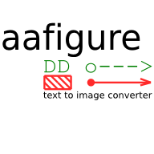

========
 Manual
========

Overview
========

The original idea was to parse ASCII art images, embedded in reST documents and
output an image. This would mean that simple illustrations could be embedded as
ASCII art in the reST source and still look nice when converted to e.g. HTML.

aafigure can be used to write documents that contain drawings in plain text
documents and these drawings are converted to appropriate formats for e.g. HTML
or PDF versions of the same document.

Since then aafigure also grew into a standalone application providing a command
line tool for ASCII art to image conversion.

ASCII Art
---------
The term "ASCII Art" describes a `wide field`_.

* (small) drawings found in email signatures
* smileys :-)
* raster images (this was popular to print images on text only printers a *few*
  years ago)
* simple diagrams using lines, rectangles, arrows

aafigure aims to parse the last type of diagrams.

.. _`wide field`: http://en.wikipedia.org/wiki/ASCII_art

Other text to image tools
-------------------------
There are of course also a lot of other tools doing text to image conversions
of some sort. One of the main differences is typically that other tools use a
description language to generate images from rules. This is a major difference
to aafigure which aims to convert good looking diagrams/images etc. in text
files to better looking images as bitmap or vector graphics.

Graphviz
    Graphviz is a very popular tool that is excellent for displaying graphs and
    networks. It does this by reading a list of relations between nodes and it
    automatically finds the best way to place all the nodes in a visually
    appealing way.

    This is quite different from aafigure and both have their strengths.
    Graphviz is very well suited to document state machines, class hierarchies
    and other graphs.

Installation
============

aafigure
--------
This installs a package that can be used from python (``import aafigure``) and
a command line script called ``aafigure``.

The Python Imaging Library (PIL) needs to be installed when support for bitmap
formats is desired and it will need ReportLab for PDF output.

To install the module for all users on the system, administrator rights (root)
is required..

From source (tar.gz or checkout)
~~~~~~~~~~~~~~~~~~~~~~~~~~~~~~~~
Unpack the archive, enter the ``aafigure-x.y`` directory and run::

    python setup.py install

Setuptools/PyPI
~~~~~~~~~~~~~~~
Alternatively it can be installed from PyPy, either manually downloading the
files and installing as described above or using::

    easy_install -U aafigure

Packages
~~~~~~~~
There are also packaged versions for some Linux distributions and Windows:

Ubuntu
    Add the repository to ``/etc/apt/sources.list`` as described on this page:
    https://launchpad.net/~aafigure-team/+archive/ppa

    Then run ``apt-get update`` and ``apt-get install aafigure``

Arch Linux
    "aafigure" (or "aafigure-bzr") are found in the category "unsupported".

Windows
    For users that have Python already installed, there is an installer for
    the extension on http://pypi.python.org/pypi/aafigure

Docutils plugin
---------------
The docutils-aafigure extension depends on the aafigure package also requires
``setuptools`` (often packaged as ``python-setuptools``) and docutils itself
(0.5 or newer) must be installed.

After that, the ``aafigure`` directive will be available.

Sphinx plugin
-------------
sphinxcontrib-aafig_ is a plugin similar to the Docutils plugin, but it
automatically selects the image format depending on the output format.

XXX elaborate

.. _sphinxcontrib-aafig: http://pypi.python.org/pypi/sphinxcontrib-aafig

Usage
=====
Command line tool
-----------------
::

    aafigure test.txt -t png -o test.png

The tool can also read from standard in and supports many options. Please look
at the command's help (or man page)::

    aafigure --help

Within Docutils
---------------
A ``aafigure`` directive is provided that allows to insert images::

    .. aafigure::

        -->

::

    ./rst2html.py README.txt >README.html

This results in the ``README.html`` file and a ``.svg`` fiel (or the specified
file type) for each ``aafigure``.

The resulting ``README.html`` file can be viewed a SVG capable browser. It has
been tested with Firefox 1.5, 2.0 and 3.0.

Within Sphinx
-------------
In ``conf.py`` add::

    extensions = ['sphinxcontrib.aafig']

This provides the ``aafig`` directive::

    .. aafig::

        -->

The output format is automatically chosen depending on the generated document
format (e.g. HTML or PDF).

